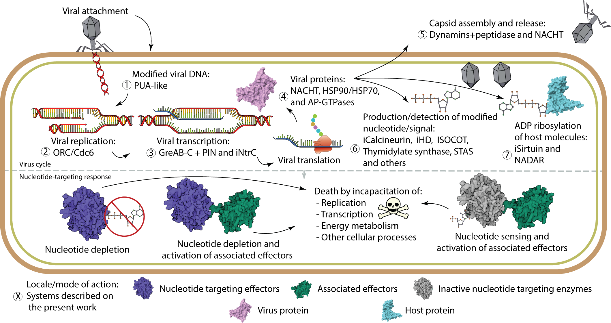

<h3 style="text-align: center;">Functionally comparable but evolutionarily distinct nucleotide-targeting effectors help identify conserved paradigms across diverse immune systems</h3>
<h3 style="text-align: center;">SUPPLEMENTARY MATERIAL</h3>

Gianlucca G. Nicastro, A. Maxwell Burroughs, Lakshminarayan M Iyer, and L Aravind
 

Computational Biology Branch, Intramural Research Program, National Library of Medicine,National Institutes of Health, Bethesda, MD 20894
 

  

1. Download all Supplementary files and data as one PDF file.
     - [PDF file](./Supp_material_r.pdf)
2. Supplementary Figures  
	 - [SFig 1 - Permuted GreAB-C structure model](./supp_images_jpeg/sup1.html)
	 - [SFig 2 - Double PIN structure model](./supp_images_jpeg/sup2.html)
	 - [SFig 3 - Phylogenetic tree of the Orc/Cdc6 proteins](./supp_images_jpeg/sup3.html)
	 - [SFig 4 - Sequence logo of multiples Calcineurin families](./supp_images_jpeg/sup4.html)
	 - [SFig 5 - Activity site and conserved residues from the Calcineurin-CE domain](./supp_images_jpeg/sup5.html)
	 - [SFig 6 - Activity site and conserved residues from the HD-CE domain](./supp_images_jpeg/sup6.html)
	 - [SFig 7 - Activity site and conserved residues from the PRTase-CE domain](./supp_images_jpeg/sup7.html)
	 - [SFig 8 - AlphaFold confidence score for the models produced on the present work](./supp_images_jpeg/sup8.html)
3. Supplementary Data  
	A. Genome contextual data  
		- [AEP-1D](./operons/AEP1D.html)  
 		- [AP-ATPase](./operons/AP-ATPase.html)  
 		- [AP-GTPase](./operons/AP-GTPase.html)  
 		- [Dynamin](./operons/dynamin.html)  
 		- [GreAB-C](./operons/GreAB-C.html)  
 		- [iHD](./operons/iHD.html)  
 		- [HSP70](./operons/HSP70.html)  
 		- [HSP90](./operons/HSP90.html)  
 		- [ISOCOT](./operons/ISOCOT.html)  
 		- [MNS](./operons/MNS.html)  
 		- [NACHT](./operons/NACHT.html)  
		- [Nadar](./operons/NADAR.html)  
 		- [ORC-Cdc6(Calcineurin-CE)](./operons/orc_calcineurin.html)  
 		- [ORC-Cdc6(HD-CE)](./operons/orc_hd.html)  
 		- [ORC-Cdc6 (PRTase-CE)](./operons/orc_prtase.html)  
 		- [ORC-Cdc6 (TIR)](./operons/orc_tir.html)  
 		- [ORC-Cdc6(SIR2)](./operons/orc_sir2.html)  
 		- [ORC-Cdc6(Kinases)](./operons/orc_kinase.html)  
 		- [ORC-Cdc6(Others)](./operons/orc_others.html)  
 		- [PUA-like](./operons/pua_like.html)  
 		- [ParB-CE](./operons/ParB_CE.html)  
 		- [ParB](./operons/ParB.html)  
 		- [Pepco](./operons/pepco.html)  
 		- [PolBetaCCAA-like](./operons/pol_beta.html)  
 		- [RVT](./operons/rvt.html)  
 		- [SAMHD1](./operons/samhd1.html)  
 		- [nSTAND4](./operons/nSTAND4.html)  
 		- [nSTAND5](./operons/nSTAND5.html)  
 		- [iSTAND3](./operons/iSTAND3.html)  
 		- [iSirtuin](./operons/iSirtuin.html)  
 		- [STAS big protein](./operons/STAS_big.html)  
 		- [STAS](./operons/STAS.html)  
 		- [Thymidylate synthase](./operons/TS.html)  
 		- [iThymidylate synthase](./operons/iTS.html)  
	B. Multiple sequence alignments  
		- [Calcineurin-CE](./alns/Colored/Calcineurin-CE.color.html)  
		- [HD-CE](./alns/Colored/HD-CE.colored.aln.html)  
		- [PRTase-CE](./alns/Colored/prtase-ce.colored.aln.html)  
		- [PUA-like-CE](./alns/Colored/PUA_like.colored.aln.html)  
		- [iSirtuin-CE](./alns/Colored/iSirtuin_colored.aln.html)  
		- [Calcineurin-CE+iThymidylate-synthase](./alns/Colored/calcineurin.iTS.colored.aln.html)  
		- [AEP-1D](./alns/Colored/AEP_1d.colored.aln.html)  
		- [REC+Calcineurin-CE](./alns/Colored/REC_calcineurin.colored.aln.html)  
		- [STAS+HisKin](./alns/Colored/STAS.hisk.colored.aln.html)  
		- [STAS+PRTase](./alns/Colored/STAS_PRTASE.colored.html)  
		- [STAS+HisKin+iPRTase+PRTase](./alns/Colored/STAS_hisk_PRTASE.colored.html)  
		- [Pepco](./alns/Colored/pepco.colored.aln.html)  
		- [iCalcineurin-CE](./alns/Colored/iCalcineurin.colored.aln.html)  
		- [iHD](./alns/Colored/iHD.colored.aln.html)  
	C. Phylogenetic Tree (Newick format)  
		- Calcineurin-CE [Download](./tree_files/calcineurin.newick), [view raw data](./tree_files/calcineurin_tree.html), [image](./tree_files/calcineurin_tree.svg)  
		- HD-CE [Download](./tree_files/hd.newick), [view raw data](./tree_files/hd.tree.html), [image](./tree_files/hd.svg)  
		- PRTase-CE [Download ](./tree_files/prtase.newick), [view raw data](./tree_files/prtase.tree.html)i, [image](./tree_files/prtase.tree.svg)  
		- ORC-Cdc6 [Download](./tree_files/orc.newick), [view raw data](./tree_files/orc.tree.html), [image](./tree_files/orc.svg)  
