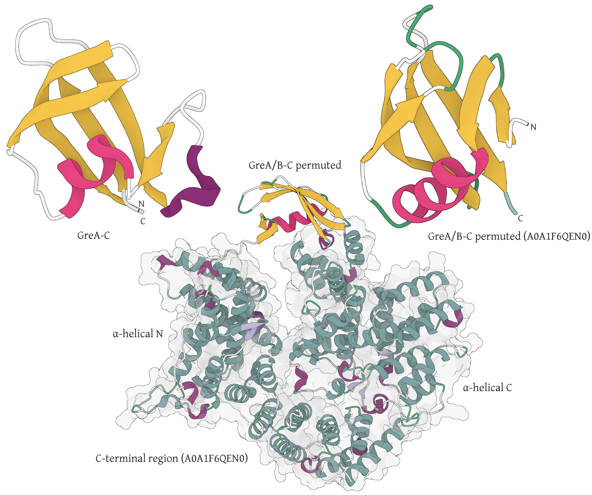

  

**Supplementary Figure S1. Permuted GreAB-C structure model.**  (A) Structure of the previously identified GreAB-C domain. (B) Alphafold model of a permuted GreAB-C domain. (C) Context of the permuted GreAB-C domain embedded in a sequence of divergent TPRs, forming a toroidal structure.

