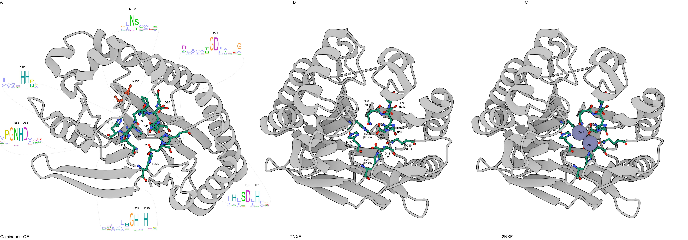

  

**Supplementary Figure S5. Activity site and conserved residues from the Calcineurin-CE domain.**  (A) Alphafold modeling of the Calcineurin-CE domain (WP_080633877.1). The residues conserved in the activity sites are shown in ball and stick representations. The synapomorphic asparagine is colored in orange. Sequence logo of the conserved regions are shown and the dotted lines indicate the start and end position of the logo in the structural model. (B and C ). Activity site of the experimental crystallized Calcineurin domain from the PDB 2NXF without and with the Zn+2 ion respectively. 

