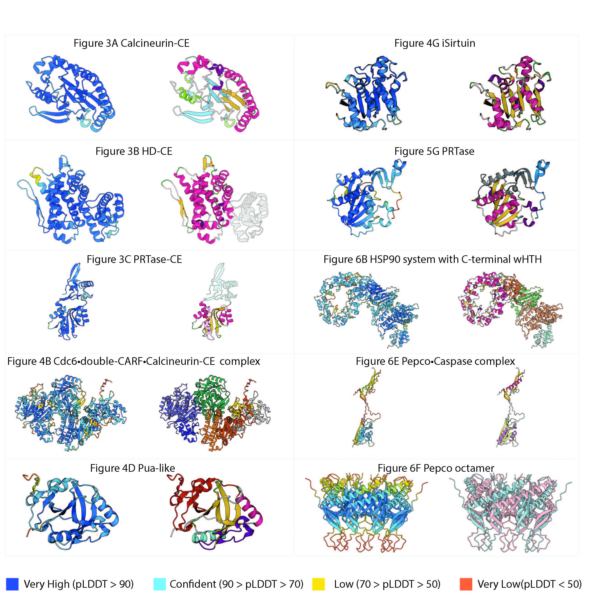

  

**Supplementary Figure S8. AlphaFold confidence score for the models produced on the present work.**  On the left the structural models colored by the pLDDT scores. On the right the structural models as colored in the figures presented on the main text. Dark blue, light blue, yellow and orange represent a very high, confident, low and very low prediction respectively.
